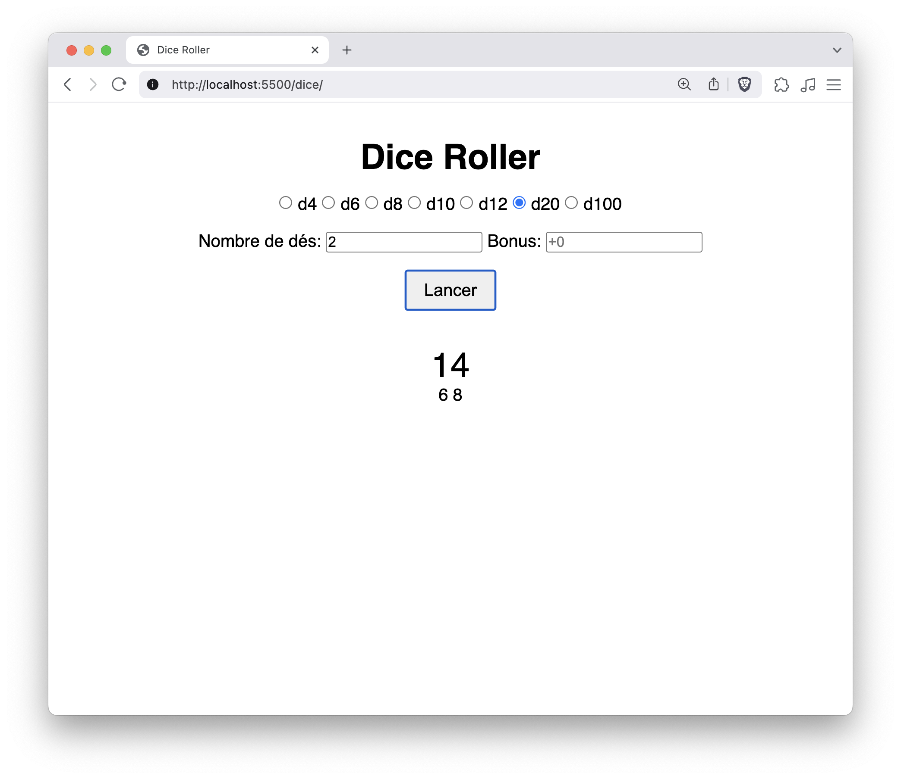
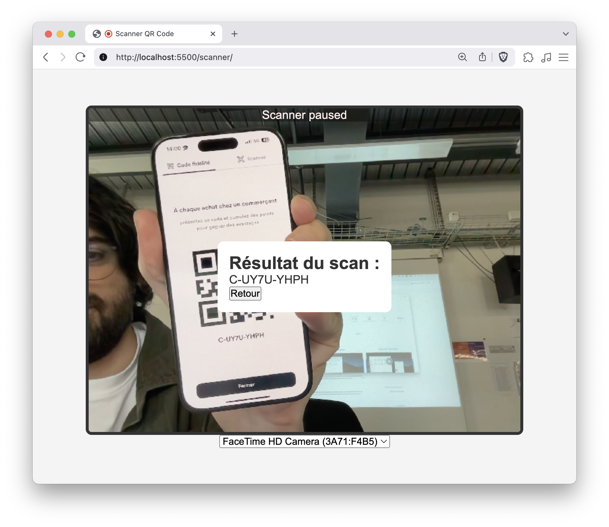
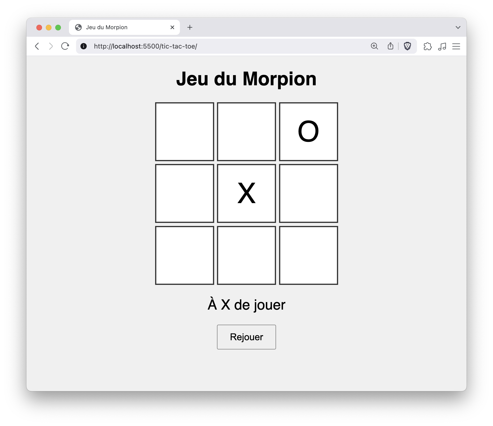

# Exercice à choix : Intégration web

## Consignes générales

Dans ce dossier, vous trouverez plusieurs projets à choix :

### Dice Roller (lanceur de dés)

### QR Code Scanner

### Tic-Tac-Toe

Vous devez choisir **un** exercice parmi ceux proposés.

## Étapes à suivre

1. **Design rapide sur Figma**

   - Réalisez une maquette du design de votre exercice sur Figma.
   - Ne passez pas trop de temps sur cette étape : l'objectif est d'avoir une idée claire du rendu visuel et de passer rapidement à l'étape de développement.

2. **Intégration HTML & CSS**

   - Intégrez votre design en HTML et CSS dans le dossier de l'exercice choisi.
   - Vous pouvez modifier le HTML et le CSS pour correspondre à votre maquette.
   - **Attention :** le code JavaScript doit rester fonctionnel ! Ne supprimez pas ou ne modifiez pas les parties JS qui assurent le fonctionnement de l'exercice. N'hésitez pas à utiliser Copilot ou une autre IA pour vous aider à corriger d'éventuelles erreurs dans le Javascript, si besoin.

3. **Publication et rendu**
   - Publiez votre travail final en ligne (FTP).
   - Pushez votre code sur GitHub après avoir fait un commit.

## Évaluation

Votre note sera basée sur :

| Critère                                                                       | Points | Coefficient |
| ----------------------------------------------------------------------------- | ------ | ----------- |
| La qualité du design (maquette Figma et rendu final)                          | 5      | 20%         |
| La qualité globale de l'intégration HTML/CSS (propreté, optimisation…)        | 5      | 50%         |
| La qualité du rendu final (respect de la maquette, responsive, accessibilité) | 5      | 20%         |
| Respect du fonctionnement JavaScript, ajout pertinent de fonctionnalités      | 5      | 10%         |

**Bon travail !**
